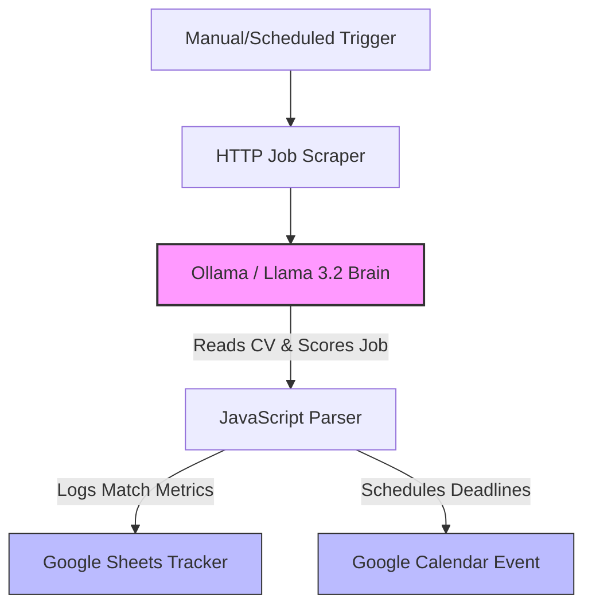

# AI-Job-Search-Agent-
An AI agent built in n8n to search, find, and apply for appropriate job listings.
# Autonomous AI Job Search & Application Agent

Welcome to my personal AI agent! I am building an end-to-end, fully automated AI agent designed to act as a personal career copilot. 

The ultimate goal of this system is simple: **It takes in my CV, continuously scrapes major job platforms for new listings, semantically evaluates how well they match my skillset, handles my schedule tracking, and automatically submits applications on my behalf once a match is found and verified.**

To maintain absolute data privacy and keep the system 100% free, the entire infrastructure runs locally on my **M4 MacBook Air** using self-hosted open-source tools.

---

##  System Architecture & Road Map

The project is split into two distinct execution phases:

### Phase 1: Sourcing, Scoring & Scheduling (Completed & Live)
1. **Discovery:** An automated scraper pulls active job postings from public feeds.
2. **Semantic Filter:** A localized LLM reads my raw CV and scores the job description from 1-10 on compatibility, providing a concise reasoning statement.
3. **Data Logging:** A custom JavaScript node merges the data layers, logging successful fits into a master Google Sheets ledger.
4. **Deadline Tracking:** The agent automatically schedules the application closing dates onto my Google Calendar.



### Phase 2: Autonomous Application Submission (In Development)
* **Human-in-the-Loop Safeguard:** Once a high-scoring match (e.g., 8/10 or higher) is identified, the agent pings me via a webhook notification (Slack/Discord) for a quick manual validation check.
* **Browser Automation Execution:** Upon approval, the agent triggers a headless browser engine (**Playwright / Puppeteer**) to navigate to the job application site .
* **Dynamic Form Filling:** The agent parses the form fields, maps my personal variables, uploads my tailored CV/Cover Letter, dynamically answers custom text questions using the LLM, and submits the application.

---

## 🛠️ Technical Stack & Skills Demonstrated

*   **Automation Framework:** n8n (Community Edition) hosted locally inside an isolated Docker container environment.
*   **Local AI Engineering:** Ollama running an optimized **Llama 3.2 (3B)** model powered by native **Apple Silicon M4 GPU (Metal)** acceleration for free, offline inference.
*   **Security & Identity Access:** Google Cloud Platform (GCP) architecture setup, utilizing custom secure OAuth2 user-data authorization client tokens.
*   **Data Engineering:** JavaScript data context manipulation to clean up and merge unstructured LLM JSON strings with structured API objects.

---

## 📂 Project Structure

*   `workflow.json`: The active structural canvas pipeline code for Phase 1.
*   `README.md`: System layout, vision roadmap, and setup guide.
*   `mock_data/`: Sample dataset snapshots showing real job listings scored by the agent.

---

##  Locally

### Prerequisites
*   Docker Desktop (Apple Silicon Edition)
*   Ollama Desktop App

### 1. Launch the Local AI Engine
Ensure Ollama is configured to accept internal network traffic from containers, then load the lightweight model:
```bash
OLLAMA_HOST=0.0.0.0 ollama serve
ollama run llama3.2
```

### 2. Launch the Automation Pipeline
Run n8n in detached background mode so it persists on your Mac:
```bash
docker run -d --name n8n -p 5678:5678 -v ~/.n8n:/home/node/.n8n docker.n8n.io/n8nio/n8n
```
Open `http://localhost:5678` in your browser, create your account, and import my `workflow.json` file to replicate the entire layout!
